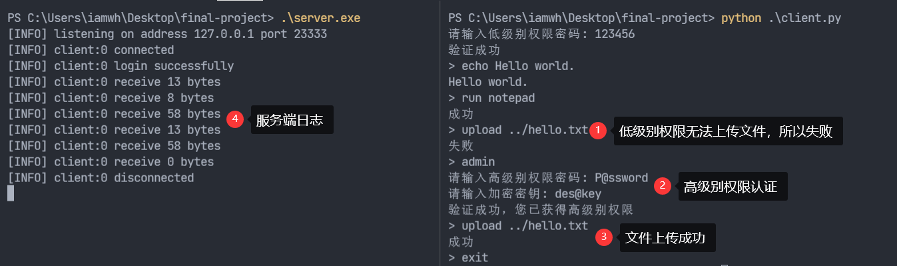

# 专业综合设计

## 客户端和服务端交互
我们设计了一个客户端和服务端，他们通过TCP socket进行通信，其中服务端采用C语言实现，客户端采用Python实现。客户端在尝试连接服务端时首先需要通过低级别权限认证，如果需要执行高级别权限下的命令则需要先通过高级别权限认证。我们定义了下面这些命令：
- `admin` 进行高级别权限认证
- `echo <str>` 执行简单的echo命令，例如`echo Hello world!`
- `run <command>` 让服务端启动一个程序，例如`run notepad`
- `upload <file path>` **[需要高级别权限]** 上传一个文件到服务端，例如`upload ../hello.txt`
- `exit` 退出客户端

低级别权限密码为`123456`，高级别权限密码会在客户端进行DES加密后发送给服务端，其中明文密码为`P@ssword`，加密密钥为`des@key`，加密结果的base64编码为`504yJb/mOCg=`。

文件上传时文件长度加上文件名长度如果超过一个buffer时会提示错误，如果确实需要上传一个较大的文件可以修改客户端和服务端定义的buffer size。

演示如下：
