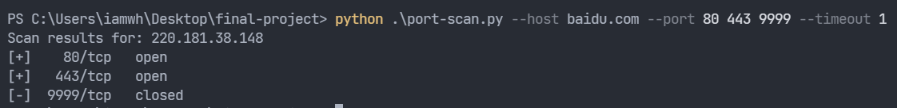

# 端口扫描器

`port-scan.py` 是一个简单的基于TCP全连接的端口扫描器，使用时需要传递三个命令行参数
- `--host` 目标主机的域名或者IP地址
- `--port` 需要扫描的目标端口，如果有多个需要用空格分割
- `--timeout` **[可选]** 指定一个建立TCP连接的timeout值

例如我们想要扫描baidu.com的80、443、9999这三个端口，则执行如下命令：
```bash
python .\port-scan.py --host baidu.com --port 80 443 9999 --timeout 1
```
效果如下：
